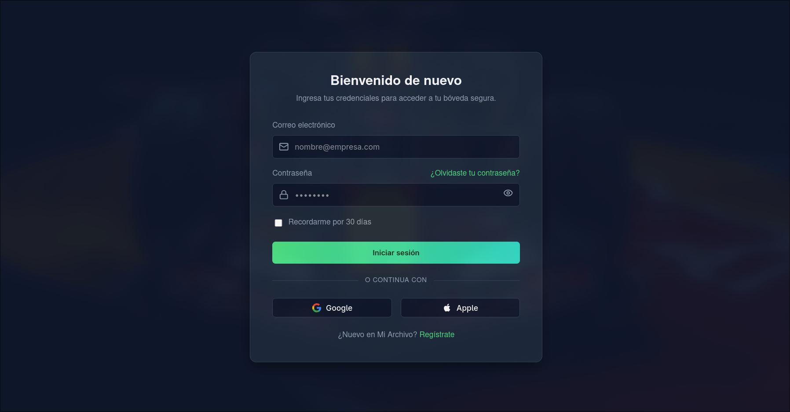
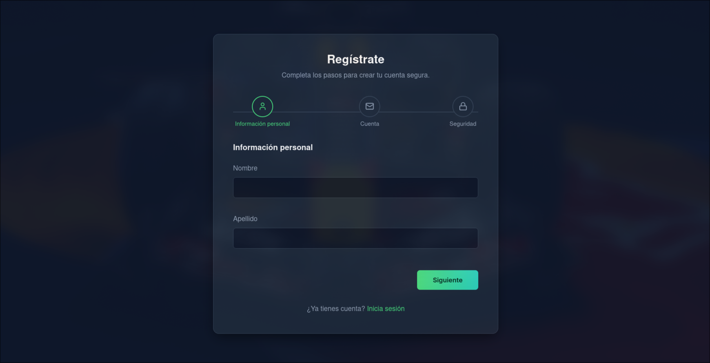
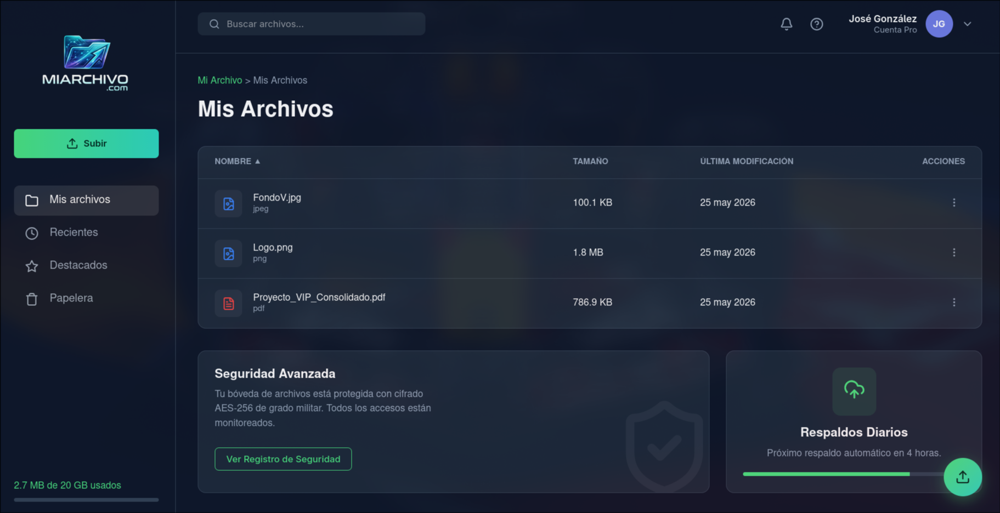
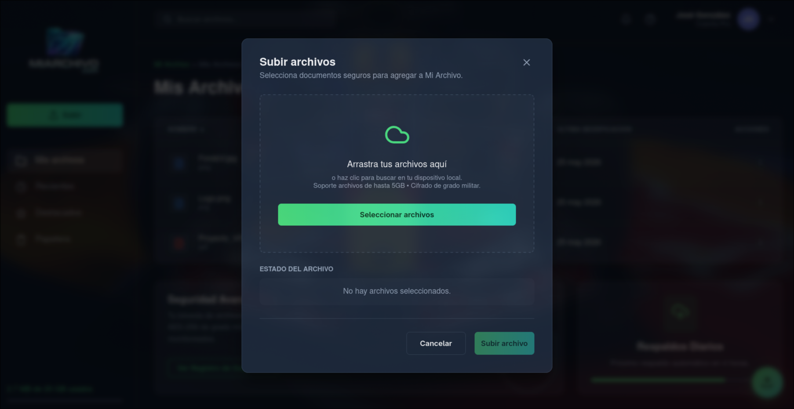
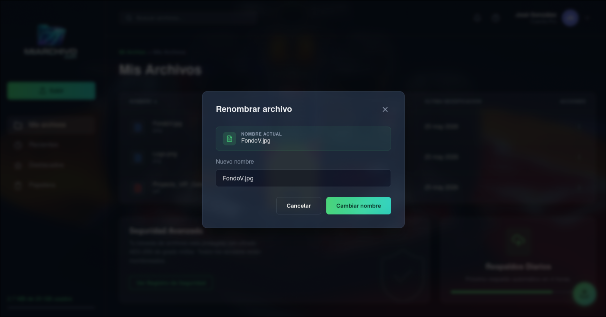
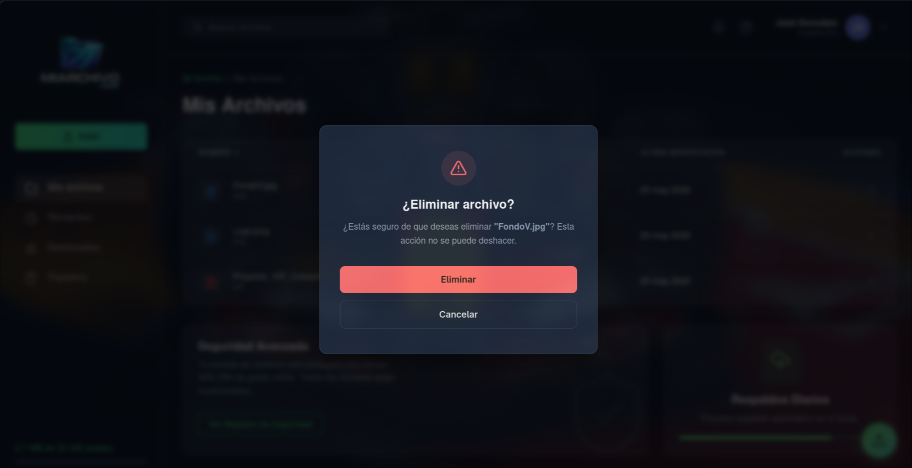
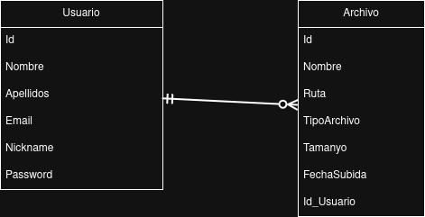

# Mi Archivo

Aplicación web para gestión de archivos privados por usuario con autenticación JWT, subida a Cloudinary y almacenamiento en SQL Server.

## Resumen

`mi-archivo` es una aplicación fullstack construida con:

- Backend: Node.js, Express, MSSQL, Cloudinary, JWT
- Frontend: React, Vite, React Router
- Autenticación: registro/login de usuario
- Funcionalidad: subir, renombrar, eliminar y ordenar archivos
- Sincronización: actualización de lista tras operaciones

## Estructura del proyecto

```
mi-archivo/
├── backend/                # API y servidor Node.js
│   ├── config/             # Configuración de Express, Cloudinary, MSSQL
│   ├── src/                # Lógica de autenticación, archivos y modelos
│   ├── .env.example        # Variables de entorno de ejemplo
│   ├── package.json
│   └── Dockerfile.backend
├── frontend/               # Aplicación React/Vite
│   ├── src/                # Componentes, hooks, servicios y rutas
│   ├── package.json
│   └── Dockerfile.frontend
├── database/               # Script de creación del esquema SQL Server
│   └── script.sql
├── docker-compose.yml      # Configuración opcional con Docker
├── setup.sh                # Instalación automática para Linux
└── setup.ps1               # Instalación automática para Windows
```

## Qué revisar antes de usar

- No comitees credenciales reales.
- Usa `backend/.env.example` como plantilla.
- Crea `backend/.env` con tus propios valores.
- El proyecto usa Cloudinary para subir archivos y SQL Server para la base de datos.

## Variables de entorno

Copia `backend/.env.example` a `backend/.env` y actualiza los valores:

```env
PORT=4001
DB_USER=sa
DB_PASSWORD=YourStrong!Passw0rd
DB_SERVER=localhost
DB_NAME=MyArchivo
SECRET_KEY=your_jwt_secret_here
CLOUDINARY_KEY=your_cloudinary_api_key
CLOUDINARY_SECRET=your_cloudinary_api_secret
CLOUDINARY_NAME=your_cloudinary_cloud_name
```

> Es importante usar credenciales propias en `.env` para no exponer datos sensibles en el repositorio.

## Requisitos

- Node.js
- npm
- SQL Server local o accedido desde `DB_SERVER`
- Cloudinary (para subir archivos)
- Opcional: Docker y Docker Compose

## Instalación rápida

### Linux / macOS

```bash
./setup.sh
```

### Windows

```powershell
.\\setup.ps1
```

Ambos scripts realizan:

- verificación de `node` y `npm`
- instalación de dependencias en `backend` y `frontend`
- validación de `react` en el frontend
- intento de aplicar el esquema SQL Server si `sqlcmd` está disponible
- comprobación básica de arranque del backend

## Uso local

### Backend

```bash
cd backend
npm run dev
```

### Frontend

```bash
cd frontend
npm run dev
```

Luego abre `http://localhost:5173`.

## Uso con Docker

Para levantar el proyecto usando contenedores:

```bash
docker compose up --build
```

## Flujo de trabajo

1. Regístrate con un usuario nuevo.
2. Inicia sesión.
3. Sube archivos desde el tablero.
4. Ordena archivos por nombre, tamaño o fecha.
5. Renombra o elimina archivos desde el menú de acciones.
6. El buscador permite filtrar por nombre de archivo.

## Seguridad y buenas prácticas

- Usa `.env` para datos privados.
- No subas claves de Cloudinary ni secretos a Git.
- Si compartes el repositorio, usa solo valores de ejemplo en `.env.example`.

## Capturas de pantalla







## Diagrama ER


## Notas importantes

Este repositorio está preparado para que cualquier persona pueda clonar, configurar su `.env` y ejecutar el proyecto localmente o en Docker. Si no tienes SQL Server instalado, usa la versión de Docker para levantar la base de datos.
